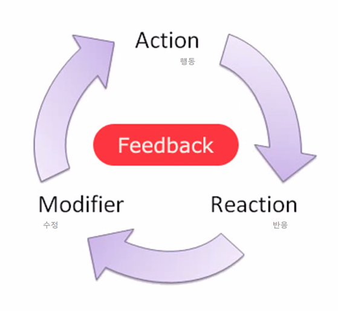

# UI/UX 특강

* 교양 : 타인과 소통하기 위해 기본이 되는 지식 not 고급문화!

## UX

* User Experience : 사용자의 경험 그 자체
  * 타인에 대한 서비스를 제공하는 것이기 때문에 타인에 대한 이해를 전제로 함
  * 다른 사람에 대한 이해를 배우는 것
* 사용자 경험이라는 총체적인 관점으로 __컨셉__을 잡고 개발의 방향을 정하기
* 다수의 사람들이 사용하는 콘텐츠는 하나의 문화가 될 수 있음
  * ex) BTS
  * 사용자 조사(리서치)가 UX의 핵심
    * SNS가 특이한 것과 좋은 것은 전혀 다른 것이기 때문에

## UI

* UX를 구현하는 제작단계에서 사용자에게 최적화되도록 디자인하기
  * 물리적인 UI
    * 가로본능폰
  * 시각적인 UI
* 사용자의 문화와 경험에 대한 조사가 반드시 필수적임

### 과제1. SNS 소개하기

* 인스타그램

  * 대중성

    * 가족/친구/지인과의 소통 창구

  * 정보 획득에 용이함

    * 뉴스

    * 브랜드

    * 연예인/유명인

      

### UX와 UI의 사례

* 어포던스(affordance, 지원성)  : 사용자가 디자인만 보고도 사용할 수 있게끔 하는 것
  * 루브르 박물관 - 파랑색이 심장 박동을 늦춘다 / 범죄율 낮추는데 기여
    * 영국의 글라스코 - 파랑색 조명을 사용하여 범죄율 30% 감소한 사례 
  * 한강 자살률 감소의 목적 - 다리에 디자인적 연출(조명 사용)
    * 움직임을 감지해 조명이 켜지고 글자가 도출되는 디자인
    * 자살률 오히려 증가
    * 계속 철거하고 펜스 설치 예정

### UX, UI의 세 가지 요소

* __사용성과 기능성__

  * 과거에는 기능성에 중심을 두었지만, _지금은 선택을 하는 사용자의 '사용성'이 중요함_

  * __사용성__ : 사용자의 니즈에 맞춘 제품이 가지는 특성

  * __기능성__ : 제조사의 입장에서 제안된 제품이 가지는 특성

  * 디자인

    * 의도, 기획, 실행의 단계를 거침

      

* __피드백__

  

  * 수정(modify)까지 하는 게 피드백의 과정임
  * 현상의 이해 → 니즈의 변화 파악 → 소비자 만족 제고  =>  컨텐츠의 성공

* __의미의 전달__
  * 다양한 리서치과정을 통해 의미있는 정보를 캐내야 함 = 정보화
    * 숨어있는 정보를 찾기 위해 다양한 리서치, 모델 평가를 진행
  * 의미를 캐내는 과정은 스토리 & 스토리텔링이 중요함
    * 서비스 사용자를 감동시켜야 함
      * ex) 알집 - 알집은... / 카트라이더 - 빌리지 운하 내 개발자의 사진 
    * 유머, 재미 감동으로 _인간적인 감성_ 에 어필해야 함

### 기획과 실행

* 앱 컨셉기획
* <u>기획의 단계</u>
  1. 문제 찾고 조사하기
  2. 생각을 구체화하기
  3. 해결방안 찾기
  4. 시각화하기

### 과제2. 문고리 디자인하기

1. 특별한 상황을 설정한다 (or 특별한 사용자)
2. 사용자의 행동을 인식한다
3. 적합한 디자인을 시행한다

* 자동문 센서가 위에 달려 있어 어린이나 신장이 작은 사용자의 경우 인식이 되지 않거나 잘 되지 않는 문제 발생
* 센서를 바닥과 문 위에 함께 설치하여 모든 출입하는 사용자들이 쉽게 이용할 수 있게 함

### UX / UI 서비스 기획

* <u>아이디어 도출하기</u>
  * 문화 콘텐츠
    * 문화 : 기록되어 전승해 내려오는 것
    * 문화 콘텐츠 : 재미있는 _문화적인 요소_ 를 _디지털 매체_ 를 통해 사람들에게 전달하여 _상업적 이윤_ 을 창출하는 것
  * 스마트 문화 콘텐츠
    * __스마트 문화 콘텐츠__ : 스마트 기기 + 문화 콘텐츠
      * ex) 스마트 그리드 - 전기의 생산, 운반, 소비 과정에 정보통신기술을 접목하여 공급자와 소비자가 서로 상호작용함으로써 효율성을 높인 지능형 전력망시스템
      * 스마트 문화 콘텐츠의 특징
        * _수평적 구조와 아이디어_ 가 핵심
          * 누구나 아이디어를 구현할 수 있음
          * 지식과 경험 늘리기 -> 자신에게 맞는 발상법 확인 -> 아이디어 발상 훈련 -> 아이디어의 교류
            * 아이디어 발상 훈련의 종류
              * 브레인 라이팅(Brain Writing, 다양한 참여자들이 함께 종이에 적음)
              * 원더링(Wandering, 플립차트에 아이디어 도출)
              * 마인드 매핑(Mind Mapping)
              * 브레인 스토밍(Brain Storming, 아이디어가 많을수록 우수한 아이디어가 나올 가능성이 많다는 원리에 입각, 일정 주제에 대한 회의 형식으로 진행)
* <u>콘텐츠 기획</u>
  * 콘셉트의 이해
    * 콘셉트(concept) : 목적을 이루기 위한 방향
  * 스토리텔링 하기
    * 이야기를 통해 감동을 주는 것 but 소설 형식의 이야기와는 다름
      * 전설과 역사
      * 역경을 이겨낸 감동
      * 근거에 의한 당위성
    * ex) 샤넬#5 - 마릴린 먼로 / 애플 - 스티븐 잡스
  * 비지니스 모델 만들기
    * 비지니스 모델의 요소
      * 가치 제안
      * 수익 매커니즘
      * 선순환 구조
      * <u>모방 불가능성</u>
    * 벤치마킹과 비교분석

